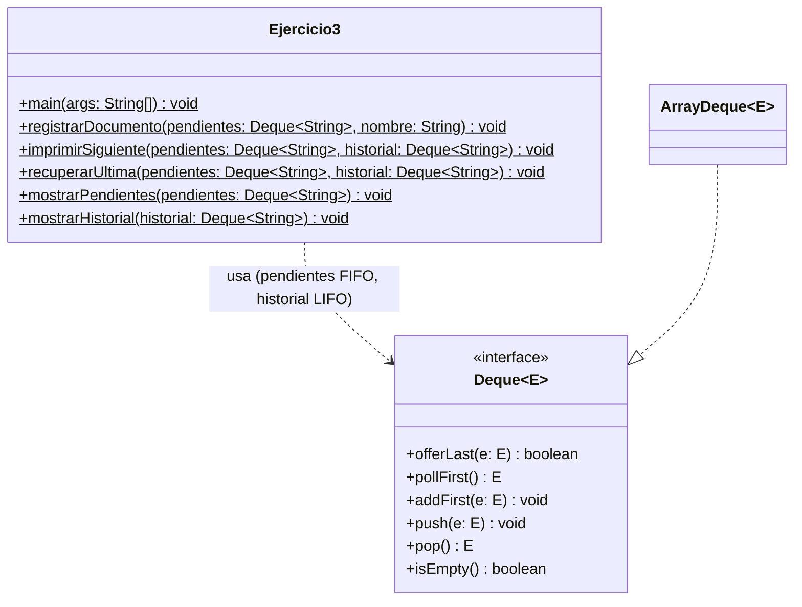

# Ejercicio 3: Gestor de impresiones

Programa en Java que simula una cola de impresión usando el **TDA Cola doble (Deque)**. La misma estructura se usa de dos formas:

- `pendientes` → funciona como **cola (FIFO)**: el primer documento que llega es el primero en imprimirse.
- `historial` → funciona como **pila (LIFO)**: el último documento impreso queda arriba de todos.

El programa se maneja desde la consola con un **menú interactivo** que se repite hasta que el usuario elige salir.

## Funcionalidades

- Registrar documentos en la lista de espera.
- Imprimir el siguiente documento y guardarlo en el historial.
- Recuperar el último documento impreso y devolverlo al inicio de la espera.
- Mostrar los documentos pendientes (en orden de impresión).
- Mostrar el historial de impresión (del más reciente al más antiguo).
- Avisar con un mensaje "Denegado" cuando no hay nada que sacar, en lugar de fallar.

## Estructura del proyecto

```
.
├── Ejercicio3.java
└── README.md
```

## TDA utilizado

**Cola doble (Deque):** colección donde se pueden agregar y sacar elementos por los dos extremos (inicio y final).
**Elementos:** `String` con el nombre de cada documento.
**Implementación:** `ArrayDeque<String>`.

| Operación | Qué hace | Precondición | Postcondición |
|---|---|---|---|
| `offerLast(e)` | Agrega un elemento al final | Ninguna | `e` queda al final y la estructura crece en 1 |
| `pollFirst()` | Saca y devuelve el primer elemento | Ninguna (si está vacía devuelve `null`) | Se quita el primero y la estructura baja en 1 |
| `addFirst(e)` | Agrega un elemento al inicio | Ninguna | `e` queda de primero y la estructura crece en 1 |
| `push(e)` | Apila un elemento en la cima (inicio) | Ninguna | `e` queda en la cima y la estructura crece en 1 |
| `pop()` | Saca y devuelve la cima | La estructura no está vacía | Se quita la cima y la estructura baja en 1 |
| `isEmpty()` | Dice si no hay elementos | Ninguna | Devuelve `true` si está vacía, `false` si no |
| `for-each` (iterador) | Recorre los elementos del inicio al final sin sacarlos | Ninguna | La estructura no cambia |

## Métodos

| Método | Qué hace | Operaciones que usa |
|---|---|---|
| `main(args)` | Muestra el menú, lee la opción y llama al método que corresponda | `Scanner`, `switch` |
| `registrarDocumento(pendientes, nombre)` | Agrega el documento al final de la espera | `offerLast` |
| `imprimirSiguiente(pendientes, historial)` | Saca el primero de la espera y lo apila en el historial | `isEmpty`, `pollFirst`, `push` |
| `recuperarUltima(pendientes, historial)` | Saca la cima del historial y la pone de primera en la espera | `isEmpty`, `pop`, `addFirst` |
| `mostrarPendientes(pendientes)` | Muestra la lista de espera sin modificarla | `isEmpty`, `for-each` |
| `mostrarHistorial(historial)` | Muestra el historial, con el más reciente primero, sin modificarlo | `isEmpty`, `for-each` |

## Menú

| Opción | Acción |
|---|---|
| 1 | Registrar documento (pide el nombre) |
| 2 | Imprimir siguiente |
| 3 | Recuperar última impresión |
| 4 | Mostrar pendientes |
| 5 | Mostrar historial |
| 6 | Salir |

Si se ingresa un número fuera del rango 1-6 el programa responde `Opcion invalida. Intente nuevamente.` y vuelve a mostrar el menú.

## Diagrama de clases



## Cómo ejecutar

Requisito: tener instalado **JDK 8 o superior**.

```bash
javac Ejercicio3.java
java Ejercicio3
```

## Salida esperada

Ejemplo de una sesión (se muestra el menú completo solo la primera vez; luego se indica únicamente la opción elegida):

```
--- Seguimiento del Gestor de Impresiones ---

Menu:
1. Registrar documento
2. Imprimir siguiente
3. Recuperar ultima impresion
4. Mostrar pendientes
5. Mostrar historial
6. Salir
Seleccione una opcion: 1
Ingrese el nombre del documento: Tesis_Cap1.pdf
[Registro] -> Entra a pendientes: Tesis_Cap1.pdf

(opcion 1) Presupuesto.xlsx
[Registro] -> Entra a pendientes: Presupuesto.xlsx

(opcion 2)
[Impresion] -> Impreso y guardado en historial: Tesis_Cap1.pdf

(opcion 1) Graficos.png
[Registro] -> Entra a pendientes: Graficos.png

(opcion 2)
[Impresion] -> Impreso y guardado en historial: Presupuesto.xlsx

(opcion 3)
[Recuperacion] -> Devuelto al inicio de pendientes: Presupuesto.xlsx

(opcion 4)
Documentos pendientes:
- Presupuesto.xlsx
- Graficos.png

(opcion 5)
Historial de impresion:
- Tesis_Cap1.pdf

(opcion 2)
[Impresion] -> Impreso y guardado en historial: Presupuesto.xlsx

(opcion 2)
[Impresion] -> Impreso y guardado en historial: Graficos.png

(opcion 2)
[Impresion] -> Denegado: no hay documentos esperando.

(opcion 6)
Saliendo del programa...
```

## Seguimiento de las estructuras

| Paso | Acción | pendientes | historial (cima primero) |
|---|---|---|---|
| 1 | Registrar `Tesis_Cap1.pdf` | [Tesis_Cap1] | [ ] |
| 2 | Registrar `Presupuesto.xlsx` | [Tesis_Cap1, Presupuesto] | [ ] |
| 3 | Imprimir siguiente | [Presupuesto] | [Tesis_Cap1] |
| 4 | Registrar `Graficos.png` | [Presupuesto, Graficos] | [Tesis_Cap1] |
| 5 | Imprimir siguiente | [Graficos] | [Presupuesto, Tesis_Cap1] |
| 6 | Recuperar última | [Presupuesto, Graficos] | [Tesis_Cap1] |
| 7 | Mostrar pendientes | [Presupuesto, Graficos] | [Tesis_Cap1] (sin cambios) |
| 8 | Mostrar historial | [Presupuesto, Graficos] | [Tesis_Cap1] (sin cambios) |
| 9 | Imprimir siguiente | [Graficos] | [Presupuesto, Tesis_Cap1] |
| 10 | Imprimir siguiente | [ ] | [Graficos, Presupuesto, Tesis_Cap1] |
| 11 | Imprimir siguiente | [ ] (Denegado) | Sin cambios |

## Autor

Andres — Ingeniería en Software, Universidad Técnica de Ambato (FISEI)
